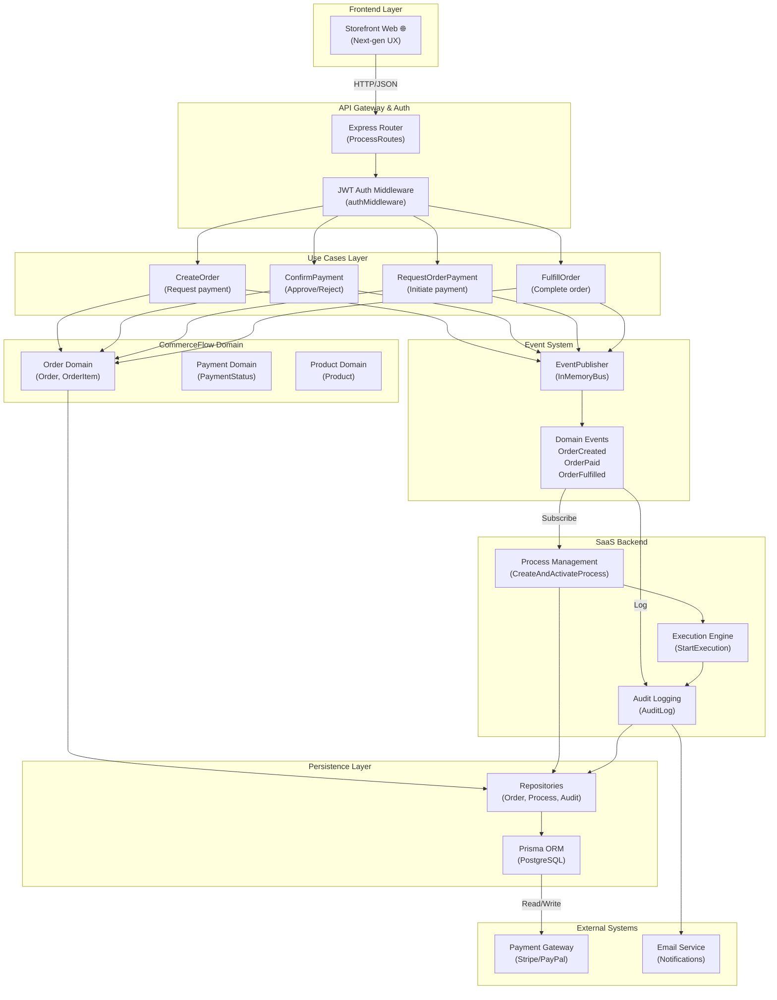
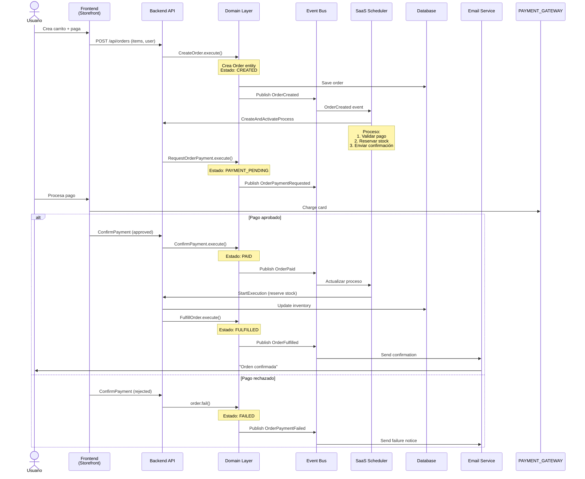
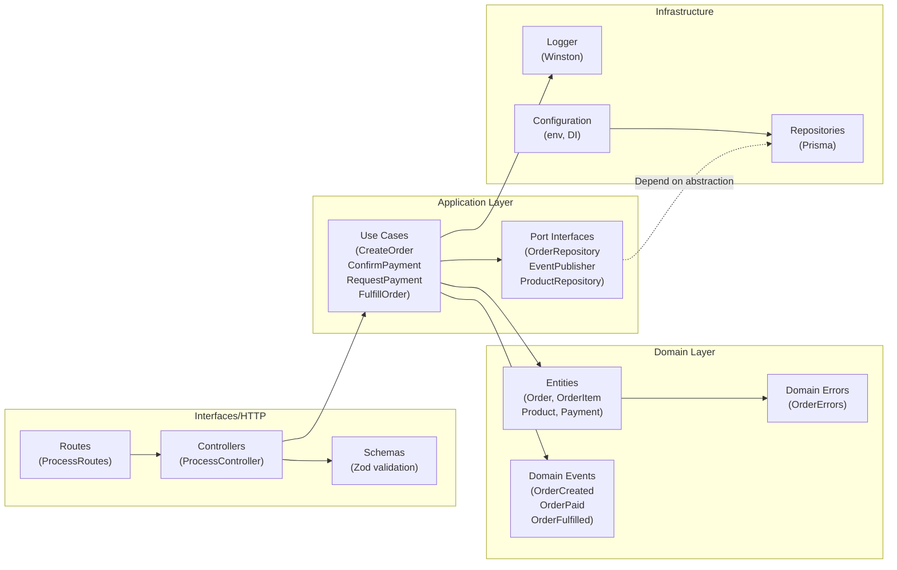
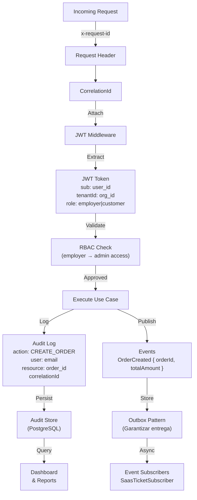
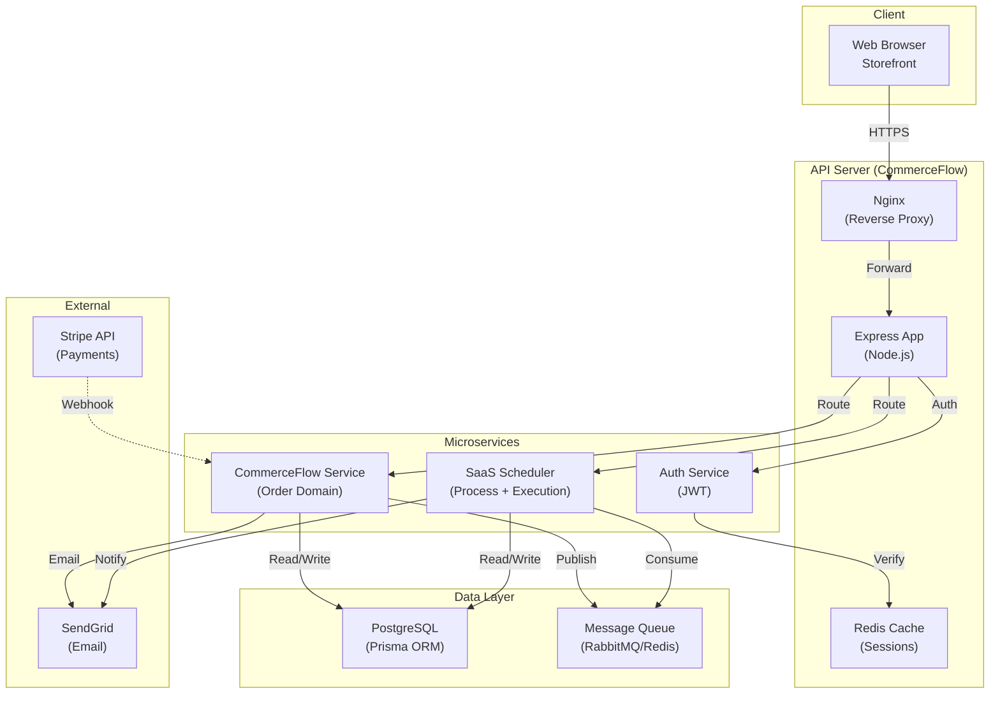

# CommerceFlow - Arquitectura del Sistema

## 📊 Diagrama General de la Plataforma



---

## 🔄 Flujo de una Orden Completa



---

## 🏗️ Arquitectura por Capas - CommerceFlow



---

## 📝 Modelos de Datos

### Order (CommerceFlow)
```
Order {
  id: UUID (generado por constructor)
  status: OrderStatus (CREATED → PAYMENT_PENDING → PAID → FULFILLED)
  items: OrderItem[]
  createdAt: Date
  
  Methods:
  + create(items): Order
  + requestPayment(): void
  + confirmPayment(): void
  + fail(): void
  + fulfill(): void
  + getTotalAmount(): number
  + getStatus(): OrderStatus
}

OrderItem {
  productId: string
  quantity: number
  unitPrice: number
  subtotal: number (calculated)
}
```

### Process (SaaS Backend)
```
Process {
  id: UUID
  organizationId: UUID
  status: ProcessStatus (DRAFT → ACTIVE → COMPLETED → PAUSED)
  steps: ProcessStep[]
  
  Methods:
  + activate(): void
  + complete(): void
  + pause(): void
}

ProcessStep {
  id: UUID
  name: string
  order: number
  status: ExecutionStatus
}
```

### Execution (Workflow)
```
Execution {
  id: UUID
  processId: UUID
  status: ExecutionStatus (PENDING → RUNNING → COMPLETED → FAILED)
  currentStep: number
  steps: ExecutionStep[]
  
  Methods:
  + start(): void
  + completeStep(stepId): void
  + fail(): void
}
```

---

## 🔐 Seguridad & Auditoría



---

## 📊 Diagrama de Componentes



---

## 🧪 Test Strategy

```
Frontend (Storefront Web)
├── Unit Tests (Utilities, formatCurrency, escapeHtml)
├── Integration Tests (Cart, Auth, Product Management)
└── E2E Tests (Full checkout flow)

Domain (CommerceFlow)
├── Entity Tests (Order lifecycle, state transitions)
├── Use Case Tests (CreateOrder, ConfirmPayment, FulfillOrder)
├── Event Tests (OrderCreated, OrderPaid, OrderFulfilled)
└── Repository Fakes (InMemoryOrderRepository)

Infrastructure (SaaS Backend)
├── Persistence Tests (Prisma repositories)
├── API Tests (ProcessController, routing)
├── Middleware Tests (Auth, logging, error handling)
└── Integration Tests (Order → Process flow)
```

---

## 📈 Flujo de Escalabilidad

```
Monolito (Actual)
    ↓
    Microservicios (Siguiente fase)
    ├── commerce-service (Orders)
    ├── process-service (Workflows)
    ├── auth-service (JWT)
    └── notification-service (Email/SMS)
    
    Distributed Tracing: Jaeger con correlationId
    Metrics: Prometheus + Grafana
    Logging: ELK Stack (JSON logs)
    API Gateway: Kong o Traefik
```

---

## 🎯 Checklist de Seguridad

- [x] JWT con algoritmo HS256
- [x] CORS configurado
- [x] Validación Zod en entrada
- [x] Correlation IDs en logs
- [x] Audit trail completo
- [ ] Rate limiting (pendiente)
- [ ] HTTPS/TLS en producción
- [ ] Secrets en variables de entorno
- [ ] SQL injection prevention (Prisma ORM)
- [ ] OWASP Top 10 checklist

---

## 🚀 Deployment Architecture

```
┌─────────────────────────────────────┐
│   Cloud Provider (AWS/GCP/Azure)    │
├─────────────────────────────────────┤
│                                     │
│  ┌─────────────────────────────┐   │
│  │  CDN (CloudFront/Cloudflare)│   │
│  │  - Storefront static files  │   │
│  └───────────────┬─────────────┘   │
│                  │                 │
│  ┌───────────────▼─────────────┐   │
│  │   Load Balancer (ALB/NLB)   │   │
│  │   - TLS termination         │   │
│  └───────────────┬─────────────┘   │
│                  │                 │
│  ┌───────────────▼─────────────┐   │
│  │  ECS/K8s Cluster            │   │
│  │  ├─ API Pod (3 replicas)    │   │
│  │  ├─ Worker Pod (2 replicas) │   │
│  │  └─ Scheduler Pod (1 replica)   │
│  └───────────────┬─────────────┘   │
│                  │                 │
│  ┌───────────────┼─────────────┐   │
│  │               │             │   │
│  │  ┌────────────▼────┐   ┌──────┐│
│  │  │  RDS PostgreSQL │   │ Redis││
│  │  │  - Data         │   │Cache ││
│  │  └─────────────────┘   └──────┘│
│  │                                 │
│  └──────────────────────────────────┘
│                                     │
└─────────────────────────────────────┘

Logs → CloudWatch/Datadog
Metrics → Prometheus/CloudWatch
Traces → Jaeger/Datadog
Alerts → PagerDuty/Opsgenie
```
